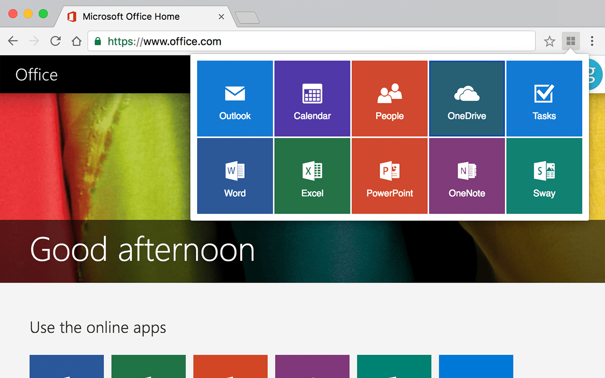

# Launchpad for Office

适用于Chrome浏览器，快速登录 Microsft Office 应用的启动器。[点此下载](https://chrome.google.com/webstore/detail/dihbdjhdjmhgggkmebfndlfpbkammabk)

## 更新历史

- 3.0.1 修正了 OneDrive 边框颜色 [2016-10-23]
- 3.0 采用全新界面，新增 Tasks 应用 [2016-10-22]
- 2.0.1 修复 OneNote 与 Outlook 应用图标显示错误 [2015-11-23]
- 2.0 采用全新界面，新增 Sway 与 Office 应用 [2015-08-16]
- 1.1 新增应用排序功能 [2014-05-03]
- 1.0 新版本发布 [2014-03-05]
